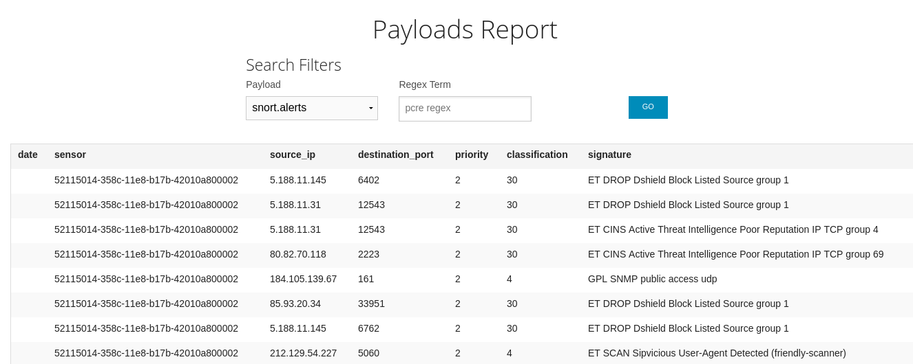
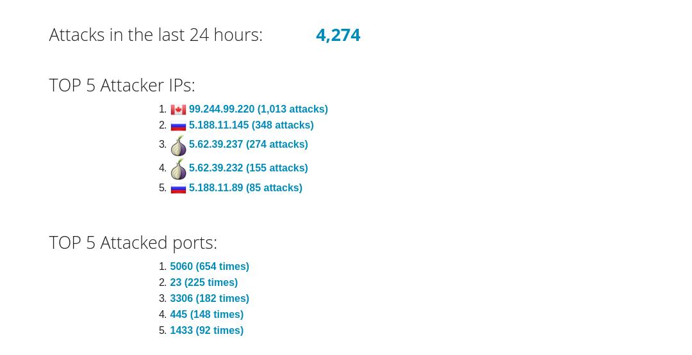

# Honeypot Assignment

### Honeypots deployed

The following shows the 4 types of of honeypots deployed and the number of attacks encountered for each:


More information on each:
*  [Dionaea](https://github.com/threatstream/mhn/wiki/Dionaea-Sensor)
*  [Wordpot](https://github.com/threatstream/mhn/wiki/Wordpot-Sensor)
*  [Snort](https://github.com/threatstream/mhn/wiki/Snort-Sensor)
*  [Conpot](https://github.com/threatstream/mhn/wiki/Conpot-Sensor)

### Issues encountered

As you can see from the previous image, the Wordpot sensor received zero attacks.
When scanned with nmap, the following output was seen:

```bash
$ nmap 35.188.20.24 
Starting Nmap 7.70 ( https://nmap.org ) at 2018-04-06 22:35 PDT
Nmap scan report for 24.20.188.35.bc.googleusercontent.com (35.188.20.24)
Host is up (0.088s latency).
Not shown: 992 closed ports
PORT     STATE    SERVICE
22/tcp   open     ssh
135/tcp  filtered msrpc
139/tcp  filtered netbios-ssn
445/tcp  filtered microsoft-ds
1023/tcp filtered netvenuechat
1720/tcp open     h323q931
2967/tcp filtered symantec-av
9898/tcp filtered monkeycom
```

The Wordpot is supposed to detect probes of a Wordpress installation.
But as you can see, port 80 or 443 are not open, which we would expect
to be for an http/https service.  So it is unclear if this is perhaps
the reason that it was never probed.  

### Data collected

The earlier sensor page showed the number of attacks collected per
honeypot over the course of the week. A visualization of this on
the map for a reduced period of time is the following:


Using the REST API, we can call the following to get the highest
number of attackers: 

`/api/top_attackers/?api_key=XXXX&hours_ago=72`

We see the most number of attacks (1013 in total) from IP Addr 99.244.99.220.
Calling `/api/attacker_stats/99.244.99.220/?api_key=XXXX`
we see that they have conducted port scans over most of the honeypot.

To look at the data collected by snort, we look at the database on the server:

```bash
$ mongo mnemosyne
> db.session.find({'honeypot': 'snort'})   
```

From this output, we see some common signatures of the attacks.  These are some samples:

*  "ET SCAN Sipvicious User-Agent Detected (friendly-scanner)" 
*  "ET DROP Dshield Block Listed Source group 1"
*  "ET CINS Active Threat Intelligence Poor Reputation IP TCP group 65"

We can see more such attacks in the payloads view: 



Looking at the Conpot we also see some interesting attacks, such as this one over http:

```json
{ "_id" : { "$oid" : "5ac5e03c616a1e77a6e10476" }, "protocol" : "http", "hpfeed_id" : { "$oid" : "5ac5e03b616a1e77a6e10475" }, "timesta
mp" : { "$date" : "2018-04-05T08:37:15.031+0000" }, "source_ip" : "95.213.177.126", "session_http" : { "pdus" : { "request" : "('http:/
/check.proxyradar.com/azenv.php?auth=152291743439&a=PSCMN&i=599555188&p=80', ['Cookie: testCookie=true\\r\\n', 'Host: check.proxyradar.
com\\r\\n', 'User-Agent: Mozilla/4.0 (compatible; MSIE 8.0; Windows NT 5.1; Trident/4.0)\\r\\n', 'Referer: https://proxyradar.com/\\r\\
n', 'Content-Type: application/x-www-form-urlencoded\\r\\n', 'Content-Length: 13\\r\\n', 'Connection: close\\r\\n'], 'testPost=true')",
 "response" : "404" } }, "source_port" : 9268, "destination_port" : 502, "identifier" : "eb44a128-358c-11e8-b17b-42010a800002", "honeyp
ot" : "conpot" }
```

Interestingly, the dashboard view showed that the SIP protocol was the most often probed:



The full output of the data collected is located in 
[session.json](https://github.com/rcmccartney/honeypot/blob/master/session.json). 

### Unresolved questions

None

